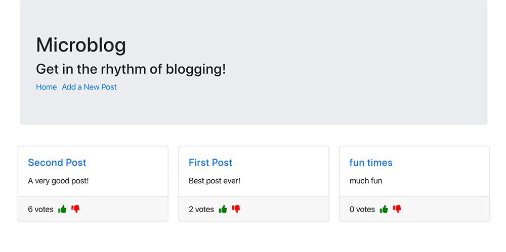
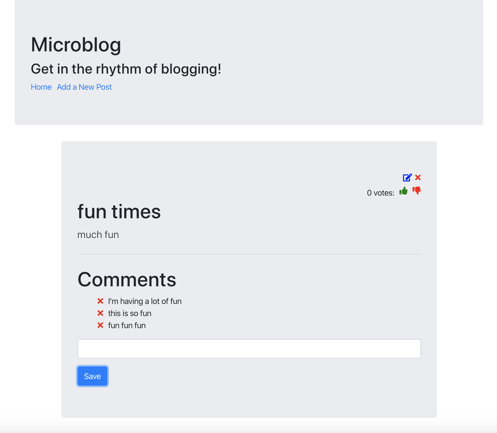

# Microblog

Microblog is a full stack anonymous microblog that allows users to create, read, edit, comment, delete, and vote on posts. Posts on the homepage are sorted by votes. I created the frontend of this application with React and Redux. 




## Installation 

Backend Setup: 

```
cd backend
npm install
node server.js
```

Frontend Setup: 
```
cd frontend
npm install 
npm start
```